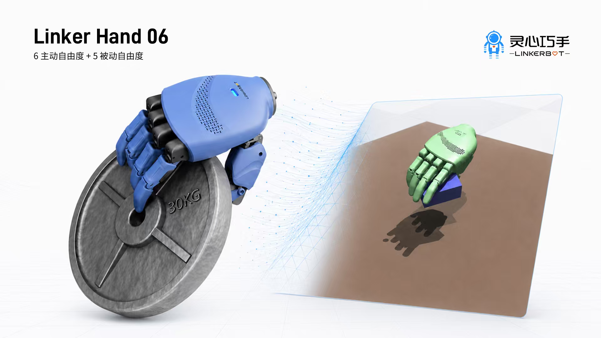
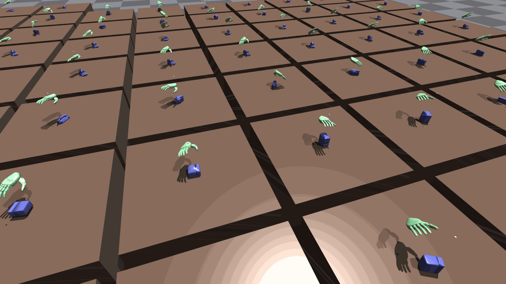
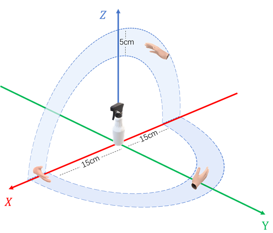

# DexGraspMotionChallenge2026

## **Sponsor**
This challenge is proudly sponsored by **LinkerBot**. 
We would like to express our sincere gratitude to **LinkerBot** for their generous support of this event.
Furthermore, the **first-place winning team** will be awarded a substantial prize package provided by **LinkerBot**.



## Overview

This repository provides example code for training and evaluating an LinkerBot's LinkerHand O6 dexterous-hand grasping baseline on GraspM3 trajectories. It includes the data preprocessing pipeline, a behavior cloning training script, and Isaac Gym rollout evaluation for learned policies.

The baseline code is adapted from [**DexRepNet**](https://github.com/LQTS/DexRep_Isaac) and [**DexGrasp-ZLX**](https://github.com/WillLxZhang/Dexgrasp-ZLX). The current implementation uses the LinkerHand O6 model and DexRep-style hand-object geometric observations.



## 1. Environment Setup

### Environment Information (Tested)

#### Operating System
- **OS**: Ubuntu 20.04.3 LTS  
- **CUDA**: 11.3


#### Build Tools
| Tool     | Version     |
|----------|-------------|
| `gcc`    | 8.4.0       |
| `g++`    | 8.4.0       |

### Environment Installation

- Create a conda environment
  
  <pre><code>git clone https://github.com/DexGraspMotionChallenge/DexGraspMotionChallenge2026.git
  cd DexGraspMotionChallenge2026
  conda create -n DexGraspMotionChallenge2026 python==3.8.19
  conda activate DexGraspMotionChallenge2026</code></pre>

- Install IsaacGym
  - Download [IsaacGym](https://developer.nvidia.com/isaac-gym/download)
  - Extract the downloaded files to the main directory of the project
  - Use the following command to install IsaacGym
  <pre><code>cd ./isaacgym/python
  pip install -e .</code></pre>
- Install other dependencies
  <pre><code>bash install.sh</code></pre>

If you encounter the error `ImportError: libpython3.8.so.1.0: cannot open shared object file: No such file or directory`, please run the following command.

<pre><code>sudo apt update
sudo apt install libpython3.8-dev</code></pre>

> **Note:** This repo is based on g++ version 8.4.0. If your g++ version is too high, you can upgrade the `transformations` and `numpy` packages to compatible versions.
  
## 2. Dataset Download
**Please fill out [this form](https://forms.office.com/r/ZzCqsy7ft8) to gain access to the dataset. The download link will automatically appear after you submit the form.** If you do not receive the download link, please submit an issue via this repository.

**You can download the mesh data of objects in GraspM3** after registration. The file is named `meshdata.tar.gz`. 

The structure of the mesh data for an example object is as follows:

<pre><code>meshdata/
├── core-bottle-cf7a79435eb5b1bdb0be98650cd7fb6f/
│   └── coacd/
│       ├── coacd.urdf
│       ├── coacd_1.urdf
│       ├── coacd_convex_piece_0.obj
│       ├── coacd_convex_piece_1.obj
│       ├── decomposed.obj
│       ├── decomposed.wrl
│       ├── decomposed_log.txt
│       ├── model.config</code></pre>

**You can download the GraspM3 dataset** after registration. The file is named `GraspM3.tar.gz`.

> **Note:**  The grasp data for the LinkerHand O6 is retargeted from the Shadow Hand; therefore, it is expected that some trajectories may fail to successfully grasp the objects. Please ensure the data is preprocessed prior to training. You can use the `data_preprocess.py` script to filter the dataset and extract only the successful grasp trajectories.

The compressed package contains multiple `.npy` files, each named after the object ID.

Each `.npy` file is a dictionary with the following keys:

- `obj_rotmat`: (B, 3, 3) array of object rotation matrices.
- `obj_scale`: (B,) array of object scaling factors.
- `grasp_seqs`: (B, T, D) array representing grasp trajectories.
  
Here, B is the number of trajectories, T is the sequence length, and D = 12 is the dimension of each grasp step, consisting of:
- the first 3 dimensions: global translation of the hand,
- the next 3 dimensions: global rotation of the hand,
- the remaining 6 dimensions: joint angles of the hand.

> **Note:** The translation parameters of the hand are defined relative to the reference point \([0, 0, 1]\).  
> For example, if the z-axis translation value of the hand is `-0.2`, it corresponds to a world coordinate z-value of `0.8`.

The illustration of the initial pose of the dexterous hand is shown below. By default, all grasps are initialized in the righthand side (z and y values are greater than 0), at a random position 15–20 cm away.


  
## 3. Baseline Method

The provided baseline is a behavior cloning policy trained from expert grasp trajectories. The policy predicts a 12-D LinkerHand O6 hand action at each step:

- 3-D wrist translation,
- 3-D wrist rotation,
- 6-D finger joint command.

The default policy network is `DexRepTemporalTCN`. It consumes a short temporal history of observations (`n_obs_steps = 8` by default) and uses a temporal convolutional encoder over DexRep observations. The default LinkerHand O6 DexRep observation layout is configured in `ActionDiffusion/bc/config/lhm_bc_o6_dexrep_full.yaml` and `dexgrasp/cfg/o6_hand_grasp_dexrep_ijrr.yaml`:

- `obs_dim.prop = 77`: compact LinkerHand O6 proprioceptive state,
- `dexrep_sensor_dim = 1040`: local hand-object DexRep sensor features,
- `dexrep_pnl_dim = 640`: point/geometry features,
- total preprocessed observation dimension: `1757`.

During training, the dataset loader reads expert trajectories and preprocessed observations from `.npy` files, then optimizes a supervised action regression loss. Checkpoints and training-loss curves are saved under `ActionDiffusion/bc/saved_models/`.

## 4. Training and Testing Examples

We provide example code for training and testing, both conducted on a **small sample objects**. 

Our method utilizes [DexRep](https://arxiv.org/pdf/2303.09806), a representation for dexterous grasping that encodes both geometric and spatial hand-object information. DexRep consists of three components: (1) Occupancy Feature, (2) Surface Feature, and (3) Local-Geo Feature.

Our baseline is trained with behavioral cloning from expert grasping trajectories. The default configuration uses a DexRep-based temporal TCN policy network.

We randomly sampled grasp trajectory data from 75 objects to train an initial baseline model in this demo, which achieved a grasp success rate of `23.93%` on the test set. This will serve as the baseline for this competition. The dataset sample is already included in the demo and is ready for direct use. Furthermore, we highly encourage participants to explore training and testing with a broader range of object data. 

> **Note:** Ultimately, the test set provided in the demo will not be used to evaluate the final performance of the submitted models. To ensure a fair and consistent assessment for all participating teams, submissions will be evaluated on a private, held-out test set. The performance on this private test set will serve as the sole criterion for the final competition scoring.  

### Training Example

Before training the model, please download GraspM3 and place a subset of the LinkerHand O6 dataset in `./dexgrasp/dataset_o6_YOURS/train` and `./dexgrasp/dataset_o6_YOURS/valid`.

Run the training with:

<pre><code>cd dexgrasp
python train_bc_lighting_dexrep.py</code></pre>

By default, `train_bc_lighting_dexrep.py` loads `ActionDiffusion/bc/config/lhm_bc_o6_dexrep_full.yaml`. You can select a different BC config with:

<pre><code>DEXGRASP_BC_CONFIG=lhm_bc_o6_dexrep_full.yaml python train_bc_lighting_dexrep.py</code></pre>

The data in `./dexgrasp/dataset_o6_75preproc/train` and `./dexgrasp/dataset_o6_75preproc/valid` included **in this demo** contains **pre-extracted DexRep features**, but these features are **not** included in `GraspM3.tar.gz`.

The data preprocessing code can be found in [data_preprocess.py](https://github.com/DexGraspMotionChallenge/DexGraspMotionChallenge2026/blob/main/dexgrasp/data_preprocess.py). Currently, the training pipeline supports **online feature extraction**, which can be time-consuming. If you prefer to **preprocess the data and save the extracted features**, please run the following command:

<pre><code>python data_preprocess.py --headless</code></pre>

The preprocessing script defaults to:

- input: `./dataset_o6_raw/train` and `./dataset_o6_raw/valid`,
- output: `./dataset_o6_preproc/train` and `./dataset_o6_preproc/valid`.

You can override these paths from the command line:

<pre><code>DEXGRASP_PREPROCESS_INPUT_ROOT=./dataset_o6_YOURS \
DEXGRASP_PREPROCESS_OUTPUT_ROOT=./dataset_o6_preproc \
python data_preprocess.py --headless</code></pre>

If an **out-of-memory error** occurs during data preprocessing, process the data in **smaller batches**:

<pre><code>DEXGRASP_PREPROCESS_N_PER_PROC=5 python data_preprocess.py --headless</code></pre>

During training, you can **modify the number of trajectories used** by changing the `seq_num` and `val_seq_num` parameters in [lhm_bc_o6_dexrep_full.yaml](https://github.com/DexGraspMotionChallenge/DexGraspMotionChallenge2026/blob/main/ActionDiffusion/bc/config/lhm_bc_o6_dexrep_full.yaml). The detailed data loading process can be found in the [GraspM3DexRepDataset](https://github.com/DexGraspMotionChallenge/DexGraspMotionChallenge2026/blob/5647adc5494dca3d94bad55765e6d6214e4ebe9c/ActionDiffusion/bc/dataset/graspm3_dexrep.py#L44) class.

To resume training from a checkpoint:

<pre><code>DEXGRASP_RESUME_CKPT=../ActionDiffusion/bc/saved_models/YOUR_EXP/last.ckpt \
python train_bc_lighting_dexrep.py</code></pre>

The training script records checkpoint losses in `checkpoint_loss.csv` and saves `checkpoint_loss_curve.png` in the same experiment directory.

### Testing Example

Run the following command to perform testing, this code can evaluate the **grasp success rate**:

<pre><code>python bc_env_infer.py --headless</code></pre>

If you want to **enable visualization**, please remove `--headless` from the command.

The **configurations** for **Isaac Gym** can be found in [o6_hand_grasp_dexrep_ijrr.yaml](https://github.com/DexGraspMotionChallenge/DexGraspMotionChallenge2026/blob/main/dexgrasp/cfg/o6_hand_grasp_dexrep_ijrr.yaml) and [o6_hand_grasp_dexrep_ijrr.py](https://github.com/DexGraspMotionChallenge/DexGraspMotionChallenge2026/blob/main/dexgrasp/tasks/o6_hand_grasp_dexrep_ijrr.py).

If you have trained your own model, either modify the `checkpoints` parameter in [lhm_bc_o6_dexrep_full.yaml](https://github.com/DexGraspMotionChallenge/DexGraspMotionChallenge2026/blob/main/ActionDiffusion/bc/config/lhm_bc_o6_dexrep_full.yaml), or pass it with an environment variable:

<pre><code>DEXGRASP_POLICY_CKPT=../ActionDiffusion/bc/saved_models/YOUR_EXP/last.ckpt \
python bc_env_infer.py --headless</code></pre>

The evaluation split is controlled by `obj_type` in [o6_hand_grasp_dexrep_ijrr.yaml](https://github.com/DexGraspMotionChallenge/DexGraspMotionChallenge2026/blob/main/dexgrasp/cfg/o6_hand_grasp_dexrep_ijrr.yaml). You can also override the evaluation data directory:

<pre><code>DEXGRASP_EVAL_DATA_DIR=./dataset_o6/valid python bc_env_infer.py --headless</code></pre>

By default, evaluation may use subprocess batching. The number of objects evaluated per subprocess is controlled by `infer_runtime.subprocess_batch_size` in `o6_hand_grasp_dexrep_ijrr.yaml`, or by:

<pre><code>DEXGRASP_SUBPROCESS_BATCH_SIZE=5 python bc_env_infer.py --headless</code></pre>

If you want to evaluate **human-likeness**, please run the example code with the following command.

<pre><code>python traj_reconstruct_error.py</code></pre>

## Citation

```bibtex
@inproceedings{liu2023dexrepnet,
  title={Dexrepnet: Learning dexterous robotic grasping network with geometric and spatial hand-object representations},
  author={Liu, Qingtao and Cui, Yu and Ye, Qi and Sun, Zhengnan and Li, Haoming and Li, Gaofeng and Shao, Lin and Chen, Jiming},
  booktitle={2023 IEEE/RSJ International Conference on Intelligent Robots and Systems (IROS)},
  pages={3153--3160},
  year={2023},
  organization={IEEE}
}

@inproceedings{li2023contact2grasp,
  title={Contact2Grasp: 3D grasp synthesis via hand-object contact constraint},
  author={Li, Haoming and Lin, Xinzhuo and Zhou, Yang and Li, Xiang and Huo, Yuchi and Chen, Jiming and Ye, Qi},
  booktitle={Proceedings of the Thirty-Second International Joint Conference on Artificial Intelligence},
  pages={1053--1061},
  year={2023}
}

@article{ye2025contact2motion,
  title={Contact2Motion: Contact guided dexterous grasp motion generation with synergy embedded optimization},
  author={Ye, Qi and Li, Haoming and Liu, Qingtao and Jiang, Shijian and Zhou, Tao and Huo, Yuchi and Chen, Jiming},
  journal={The International Journal of Robotics Research},
  pages={02783649251364392},
  year={2025},
  publisher={SAGE Publications Sage UK: London, England}
}
```
